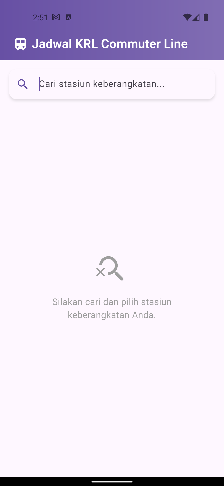
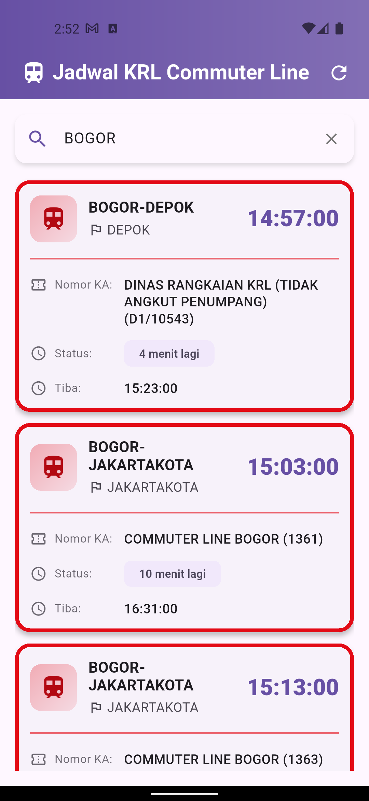
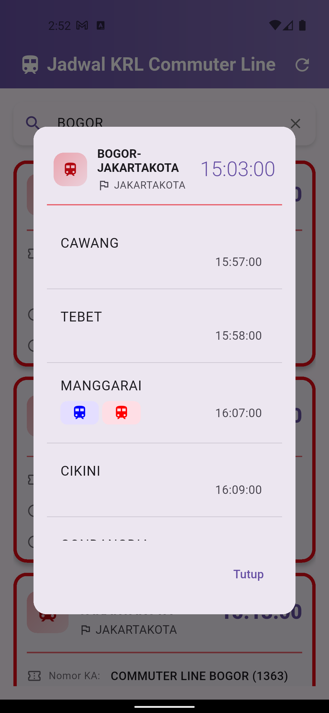

# 🚆 KRL Schedule

**KRL Schedule** is your ultimate companion for navigating Indonesia's commuter lines! This unofficial yet powerful app provides real-time schedules, making your daily commute smarter, faster, and hassle-free. 🌟 Whether you're planning your journey or checking the next train, **KRL Schedule** has everything you need! 🚉✨

---

## 🌟 Features

- 🕒 **Real-Time Schedule Updates**: Stay on track with the latest commuter line schedules.
- 🔍 **Station Search**: Find departure and arrival stations in seconds with an intuitive search feature.
- 🚄 **Nearest Train Info**: See the next trains departing from your station at a glance.
- 🗺️ **Detailed Route Info**: View all stations along your route, with estimated times and transit stations highlighted by line colors. 🎨
- 🔄 **Flash Refresh**: Instantly refresh data for the most accurate schedule updates.
- 📱💻 **Cross-Platform Access**: Use it seamlessly on Android and the web.

---

## 🚀 Installation

1. Clone the repository:
    ```bash
    git clone https://github.com/emRival/commuterline-schedule.git
    ```
2. Navigate to the project directory:
    ```bash
    cd krl_schedule
    ```
3. Install dependencies:
    ```bash
    flutter pub get
    ```
4. Run the application:
    ```bash
    flutter run
    ```

---

## 🛠️ Usage

1. Open the app on your Android device or web browser. 🌐📱
2. Use the **Search Station** feature to select your departure and arrival stations. 🔍
3. View the list of trains departing soonest from your station. 🚄
4. Tap on a train to see detailed route information, including all stations and estimated times. Transit stations are highlighted for easy navigation. 🗺️
5. Use the **Flash Refresh** button to update the schedule instantly. 🔄

---

## 🛠️ Technologies Used

- 🖥️ **Framework**: Flutter
- 🔥 **Backend**: API Kai Commuter Line
- 🎨 **Styling**: Material Design

---

## 🌐 Web Version

Access the web version here: [KRL Schedule Web](https://emrival.github.io/commuterline-schedule/) 🌍

---

## 📸 Screenshots

### 🚉 Search Station | 🚄 Train List | 🗺️ Route Details
<p align="center">
  
  
  
</p>

---

## 🤝 Contributing

We welcome contributions! Follow these steps to get started:

1. Fork the repository. 🍴
2. Create a new branch:
    ```bash
    git checkout -b feature/your-feature-name
    ```
3. Commit your changes:
    ```bash
    git commit -m "Add your message here"
    ```
4. Push to the branch:
    ```bash
    git push origin feature/your-feature-name
    ```
5. Open a pull request. 🚀

---

## 📜 License

This project is licensed under the [MIT License](LICENSE). 📄

---

## 📧 Contact

Have questions or need support? Reach out to us! 💌
- **Instagram**: [@em_rival](https://instagram.com/em_rival/)
- **GitHub**: [emRival](https://github.com/emRival)

---

🌟 Experience a smarter, more efficient way to commute with **KRL Schedule**! Your journey, redefined. 🚉✨
